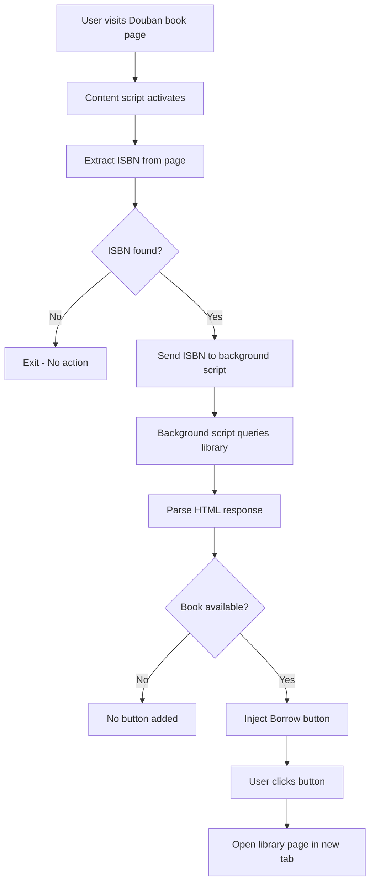

# Douban Library Extension Architecture

## Overview
This Edge extension enhances Douban book detail pages by adding library borrowing functionality. It checks if books are available in the Beijing Library (bjyth.jiatu.cloud) and adds a "Borrow" button when available.

## Extension Workflow



## Component Structure

```
ext/
├── manifest.json           # Extension configuration
├── content.js             # Runs on Douban pages
├── background.js          # Handles cross-origin requests
├── styles.css            # Button styling
├── icons/                # Extension icons
│   ├── icon-16.png
│   ├── icon-48.png
│   └── icon-128.png
├── package.json          # Development dependencies
└── README.md            # User documentation
```

## Key Components

### 1. Content Script (content.js)
- **Runs on**: `https://book.douban.com/subject/*`
- **Responsibilities**:
  - Extract ISBN from book detail page
  - Send ISBN to background script
  - Inject "Borrow" button when book is available
  - Handle button click events

### 2. Background Script (background.js)
- **Purpose**: Handle cross-origin requests (CORS bypass)
- **Responsibilities**:
  - Receive ISBN from content script
  - Query library search API
  - Parse HTML response
  - Return availability status

### 3. Manifest Configuration
- **Permissions needed**:
  - `https://book.douban.com/*` (content script injection)
  - `https://bjyth.jiatu.cloud/*` (library API access)
  - `activeTab` (interact with current tab)
  - `storage` (optional, for caching)

## Data Flow

1. **ISBN Extraction**:
   - Look for ISBN in book info section
   - Format: ISBN-10 or ISBN-13
   - Location: Usually under "书籍信息" section

2. **Library Query**:
   - URL: `https://bjyth.jiatu.cloud/yuntu-pc/home/search/index?word={ISBN}`
   - Method: GET request via background script
   - Response: HTML page with search results

3. **Availability Check**:
   - Parse HTML for book status
   - Look for availability indicators
   - Common patterns: "可借", "在架", "available"

4. **Button Injection**:
   - Location: Next to ISBN number
   - Style: Blue button (#2E7FBE)
   - Text: "图书馆借阅" or "Borrow"
   - Action: Opens library page in new tab

## Technical Considerations

1. **CORS Handling**: 
   - Library site may block cross-origin requests
   - Solution: Use background script as proxy

2. **Page Structure Changes**:
   - Douban may update their HTML structure
   - Use robust selectors and fallbacks

3. **Performance**:
   - Cache library queries (optional enhancement)
   - Debounce multiple requests

4. **Error Handling**:
   - Network failures
   - ISBN not found
   - Library site changes

## Security Considerations

- Only inject scripts on trusted domains
- Validate ISBN format before querying
- Sanitize any HTML content from library response
- Use Content Security Policy in manifest

## Testing Strategy

1. Test with various ISBN formats
2. Test with books available/unavailable
3. Test network error scenarios
4. Test on different Douban page layouts
5. Verify button styling consistency

## Future Enhancements (Out of scope for MVP)

- Support multiple library systems
- Show real-time availability count
- Add reservation functionality
- Cache queries for performance
- User preferences/settings page