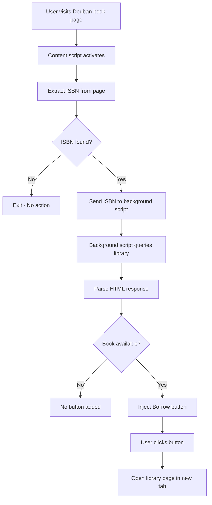

# Douban Library Extension Architecture

## Overview
This Edge extension enhances Douban book detail pages by adding library borrowing functionality. It checks if books are available in the Beijing Library (bjyth.jiatu.cloud) and adds a "Borrow" button when available.

## Extension Workflow


```mermaid
flowchart TD
    A[User visits Douban book page] --> B[Content script activates]
    B --> C[Extract ISBN from page]
    C --> D{ISBN found?}
    D -->|No| E[Exit - No action]
    D -->|Yes| F[Send ISBN to background script]
    F --> G[Background script queries library]
    G --> H[Parse HTML response]
    H --> I{Book available?}
    I -->|No| J[No button added]
    I -->|Yes| K[Inject Borrow button]
    K --> L[User clicks button]
    L --> M[Open library page in new tab]
```

## Component Structure

```
├── manifest.json           # Extension configuration (Manifest V3)
├── content.js              # Runs on Douban pages
├── background.js           # Service worker handling cross-origin API requests
├── styles.css              # Button styling
├── rules.json              # declarativeNetRequest rules for header modification
├── eslint.config.js        # ESLint flat config (neostandard)
├── icons/                  # Extension icons
│   ├── icon-16.png
│   ├── icon-48.png
│   └── icon-128.png
├── package.json            # Development dependencies & scripts
├── ARCHITECTURE.md         # This document
└── README.md               # User documentation
```

## Key Components

### 1. Content Script (content.js)
- **Runs on**: `https://book.douban.com/subject/*`
- **Responsibilities**:
  - Extract ISBN from book detail page
  - Send ISBN to background script
  - Inject "Borrow" button when book is available
  - Handle button click events

### 2. Background Script (background.js)
- **Purpose**: Handle cross-origin API requests (CORS bypass)
- **Responsibilities**:
  - Receive ISBN from content script via `chrome.runtime.sendMessage`
  - Generate authentication parameters (salt, sign, timestamp) for the library API
  - Query `https://apps.jiatu.cloud/client/book/search` API
  - Parse JSON response and extract availability data across branches
  - Return structured availability info (available copies, libraries, detail URLs)

### 3. Declarative Net Request Rules (rules.json)
- **Purpose**: Modify request headers for the library API
- **Sets**: `Origin`, `Referer`, `Sec-Fetch-*` headers to emulate same-site requests
- **Target**: `apps.jiatu.cloud/client/book/search`

### 3. Manifest Configuration
- **Permissions needed**:
  - `activeTab` (interact with current tab)
  - `declarativeNetRequest` (modify API request headers)
- **Host permissions**:
  - `https://book.douban.com/*` (content script injection)
  - `https://bjyth.jiatu.cloud/*` (library site)
  - `https://apps.jiatu.cloud/*` (library search API)

## Data Flow

1. **ISBN Extraction**:
   - Look for ISBN in `#info` section
   - Supports ISBN-10 and ISBN-13 formats
   - Strips hyphens for normalization

2. **Library Query**:
   - API: `POST https://apps.jiatu.cloud/client/book/search`
   - Auth: MD5-based sign generation with salt and timestamp
   - Request body includes `libcode: "BJYTH"`, keyword (ISBN), and auth params
   - Headers modified by `declarativeNetRequest` rules

3. **Availability Check**:
   - Parse JSON response for `books[]` array
   - Check `availableLibs` and `ownerLibs` per book
   - Map library codes to human-readable names via `aggData`
   - Aggregate total/available copies across branches

4. **Button Injection**:
   - Location: Next to the ISBN field
   - States: "图书馆借阅" (available, blue), "图书馆查看" (owned but unavailable, gray), "未找到此书" (not found, light gray)
   - Tooltip: Shows per-branch availability details
   - Action: Opens library detail/search page in new tab

## Technical Considerations

1. **CORS Handling**: 
   - Library site may block cross-origin requests
   - Solution: Use background script as proxy

2. **Page Structure Changes**:
   - Douban may update their HTML structure
   - Use robust selectors and fallbacks

3. **Performance**:
   - Cache library queries (optional enhancement)
   - Debounce multiple requests

4. **Error Handling**:
   - Network failures
   - ISBN not found
   - Library site changes

## Security Considerations

- Only inject scripts on trusted domains
- Validate ISBN format before querying
- Sanitize any HTML content from library response
- Use Content Security Policy in manifest

## Testing Strategy

1. Test with various ISBN formats
2. Test with books available/unavailable
3. Test network error scenarios
4. Test on different Douban page layouts
5. Verify button styling consistency

## Future Enhancements (Out of scope for MVP)

- Support multiple library systems
- Show real-time availability count
- Add reservation functionality
- Cache queries for performance
- User preferences/settings page